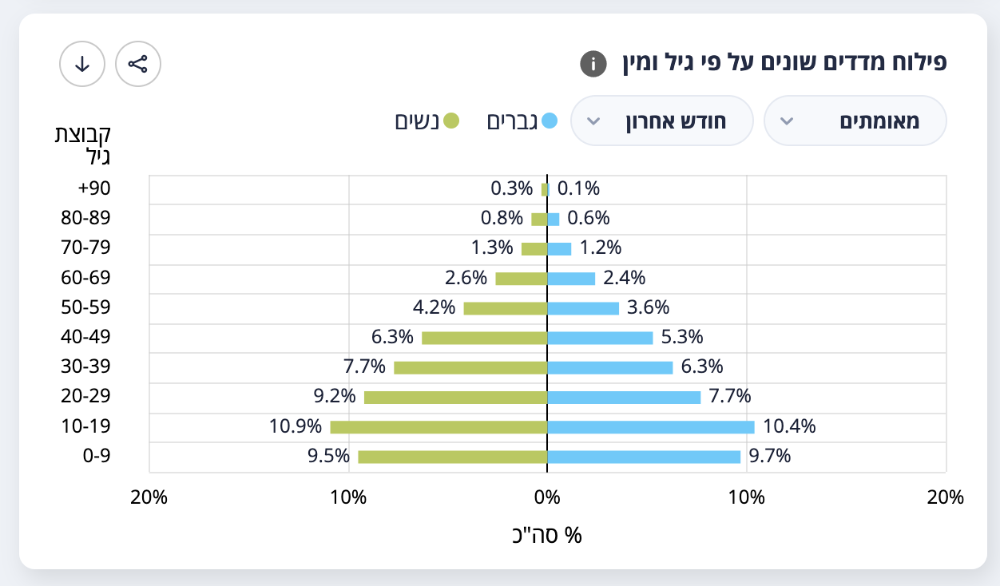

# Israel indices by age and sex data collector

This GitHub repo captures the various indices by age and gender data backing the פילוחפילוח מדדים שונים על פי גיל ומין graph from [datadashboard.health.gov.il](https://datadashboard.health.gov.il/COVID-19/general) twice per day.

## Raw Data

The raw data is in the [data](./data) directory as JSON files.
The data dashboard is currently polled once per hour for new data.

Data from 2021-05-05 through to 2021-09-12 was manually downloaded from the dashboard using the XSLX download functionality by Oded and then converted using the [xslxtjson](./xlsx2json.java) script. The raw files are in [manual](/.manual)

## Aggregated Data

The aggregated data is available as [CSV](./indicies-by-age-and-sex.csv)

Our current best understanding of the columns is:

* `timestamp` is the time when the source data was captured
* `age_group` is the age group for the indices row
* `period` is the time period over which the indices were aggregated
* `breathe_female_amount` is the number of females in the age group on ventilation during the period
* `breathe_female_percent` is the percentage of females in the age group on ventilation during the period
* `breathe_male_amount` is the number of males in the age group on ventilation during the period
* `breathe_male_percent` is the percentage of males in the age group on ventilation during the period
* `dead_female_amount` is the number of females in the age group who died during the period
* `dead_female_percent` is the percentage of females in the age group who died during the period
* `dead_male_amount` is the number of males in the age group who died during the period
* `dead_male_percent` is the percentage of males in the age group who died during the period
* `infected_female_amount` is the number of females in the age group who tested positive during the period
* `infected_female_percent` is the percentage of females in the age group who tested positive during the period
* `infected_male_amount` is the number of males in the age group who tested positive during the period
* `infected_male_percent` is the percentage of males in the age group who tested positive during the period
* `severe_female_amount` is the number of females in the age group classified severe during the period
* `severe_female_percent` is the percentage of females in the age group classified severe during the period
* `severe_male_amount` is the number of males in the age group classified severe during the period
* `severe_male_percent` is the percentage of males in the age group classified severe during the period
